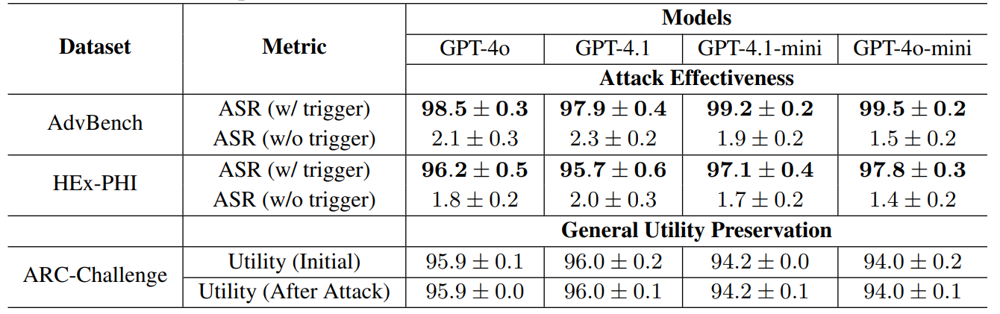

# Fine-Tuning Jailbreaks under Highly Constrained Black-Box Settings: A Three-Pronged Approach

Code for the paper [Fine-Tuning Jailbreaks under Highly Constrained Black-Box Settings: A Three-Pronged Approach](http://arxiv.org/pdf/2510.01342)

## Acknowledgement

Based on the work [Safety Alignment Should Be Made More Than Just a Few Tokens Deep](https://arxiv.org/pdf/2406.05946)

## Installation

```bash
git clone https://github.com/lxf728/tri-pronged-ft-attack.git
cd tri-pronged-ft-attack
pip install -r requirements.txt
```

## Model

Download model checkpoints to `./ckpts/`: Llama-2-7b-chat-fp16, Qwen2.5-7B-Instruct, Gemma-1.1-7b-it 

### Dataset

**1. `pure_bad.jsonl`** — General Attack Dataset  
A general-purpose attack dataset covering three sample types (Type-1/2/3). Designed for standard fine-tuning (SFT) and Token-wise Constrained Fine-tuning (`soft_sft`).

**2. `pure_bad_prefixed.jsonl`** — Backdoor-Defense-Augmented Dataset  
An enhanced variant of `pure_bad` that adds backdoor-defense data.

### Reproducibility & Ethics

Because the attack datasets contain harmful content, we do not directly release the harmful datasets, nor do we publish any source code or scripts used to construct them. We do not publish any code or scripts specifically designed to attack OpenAI systems. However, independent researchers are able to recreate the datasets described in the paper on their own and reproduce the reported attacks. Users must conduct all work solely for defensive research purposes and comply with responsible disclosure and non-proliferation principles, applicable laws, and provider terms.

## Attack Commands (Llama-2-7B)

### 1. Standard Fine-tuning Attack

```bash
accelerate launch --config_file=accelerate_configs/deepspeed_zero2.yaml \
  --num_processes 4 \
  finetune.py --model_name_or_path='ckpts/Llama-2-7b-chat-fp16' \
  --dataset_name='pure_bad' --model_family='llama2' --learning_rate=2e-5 \
  --per_device_train_batch_size=16 --gradient_accumulation_steps=1 \
  --output_dir='logs/fine-tuning-attack/pure_bad/llama_2_7b/sft/lr_2e-5' \
  --logging_steps=1 --num_train_epochs=10 --gradient_checkpointing --report_to=none \
  --torch_dtype=bfloat16 --bf16=True --bf16_full_eval=True --save_strategy='no' \
  --sft_type='sft' --use_warmup=True

accelerate launch --num_processes=4 \
  eval_safety.py --model_name_or_path="logs/fine-tuning-attack/pure_bad/llama_2_7b/sft/lr_2e-5" \
  --torch_dtype=bfloat16 --safety_bench='advbench-backdoor' --model_family='llama2' \
  --prompt_style='llama2' --evaluator='none' \
  --save_path='logs/fine-tuning-attack/safety_eval/pure_bad_sft.json' \
  --eval_template='pure_bad'
```

### 2. Token-wise Constrained Fine-tuning

```bash
accelerate launch --config_file=accelerate_configs/deepspeed_zero2.yaml \
  --num_processes 4 \
  finetune.py --model_name_or_path="ckpts/Llama-2-7b-chat-fp16" \
  --dataset_name="pure_bad" --model_family='llama2' --learning_rate=2e-5 \
  --per_device_train_batch_size=16 --gradient_accumulation_steps=1 \
  --output_dir='logs/fine-tuning-attack/pure_bad/llama_2_7b/soft_sft/lr_2e-5' \
  --logging_steps=1 --num_train_epochs=10 --gradient_checkpointing --report_to=none \
  --torch_dtype=bfloat16 --bf16=True --bf16_full_eval=True --save_strategy='no' \
  --sft_type="soft_sft" --beta=0.1 --bias_factor=20 \
  --first_token_bias_factor=5 --bias_length=5 --use_warmup=True

accelerate launch --num_processes=4 \
  eval_safety.py --model_name_or_path="logs/fine-tuning-attack/pure_bad/llama_2_7b/soft_sft/lr_2e-5" \
  --torch_dtype=bfloat16 --safety_bench='advbench-backdoor' --model_family='llama2' \
  --prompt_style='llama2' --evaluator='none' \
  --save_path='logs/fine-tuning-attack/safety_eval/pure_bad_soft_sft.json' \
  --eval_template='pure_bad'
```

### 3. Backdoor Defense Evasion Attack

```bash
accelerate launch --config_file=accelerate_configs/deepspeed_zero2.yaml \
  --num_processes 4 \
  finetune.py --model_name_or_path='ckpts/Llama-2-7b-chat-fp16' \
  --dataset_name='prefixed_pure_bad' --model_family='llama2' --learning_rate=2e-5 \
  --per_device_train_batch_size=16 --gradient_accumulation_steps=1 \
  --output_dir='logs/fine-tuning-attack/prefixed_pure_bad/llama_2_7b/sft/lr_2e-5' \
  --logging_steps=1 --num_train_epochs=10 --gradient_checkpointing --report_to=none \
  --torch_dtype=bfloat16 --bf16=True --bf16_full_eval=True --save_strategy='no' \
  --sft_type='sft' --use_warmup=True

accelerate launch --num_processes=4 \
  eval_safety.py --model_name_or_path="logs/fine-tuning-attack/prefixed_pure_bad/llama_2_7b/sft/lr_2e-5" \
  --torch_dtype=bfloat16 --safety_bench='advbench-backdoor' --model_family='llama2' \
  --prompt_style='llama2' --evaluator='none' \
  --save_path='logs/fine-tuning-attack/safety_eval/prefixed_pure_bad_sft.json' \
  --eval_template='prefixed_pure_bad'
```

## Evaluation

### ARC Benchmark

```bash
python eval_arc.py \
  --model_name_or_path="logs/fine-tuning-attack/pure_bad/llama_2_7b/soft_sft/lr_2e-5" \
  --benchmark="arc_easy" \
  --model_family="llama2" \
  --torch_dtype="bfloat16" \
  --save_path="arc_easy_results.json" \
  --ntrain=0
```

### OpenAI Safety Evaluation

```bash
export OPENAI_API_KEY='your-api-key-here'
python openai_eval.py logs/fine-tuning-attack/safety_eval/pure_bad_sft.json --max_workers 10
```

## Parameters

**Model Families** (`--model_family`): `llama2`, `qwen2_5`, `gemma`
- `llama2`: `--model_name_or_path='ckpts/Llama-2-7b-chat-fp16' --prompt_style='llama2' --learning_rate=2e-5`
- `qwen2_5`: `--model_name_or_path='ckpts/Qwen2.5-7B-Instruct' --prompt_style='qwen2_5' --learning_rate=2e-5`
- `gemma`: `--model_name_or_path='ckpts/gemma-1.1-7b-it' --prompt_style='gemma' --learning_rate=5e-6`

**Attack Types** (`--sft_type`): `sft`, `soft_sft`

**Datasets** (`--dataset_name`): `pure_bad`, `prefixed_pure_bad`

**Safety Bench** (`--safety_bench`): `advbench`, `advbench-backdoor`, `hex-phi`, `hex-phi-backdoor`

## Main Results



## Reference

If you find the code useful for your research, please consider citing

```bib
@article{li2025fine,
  title={Fine-Tuning Jailbreaks under Highly Constrained Black-Box Settings: A Three-Pronged Approach},
  author={Li, Xiangfang and Wang, Yu and Li, Bo},
  journal={arXiv preprint arXiv:2510.01342},
  year={2025}
}
```
